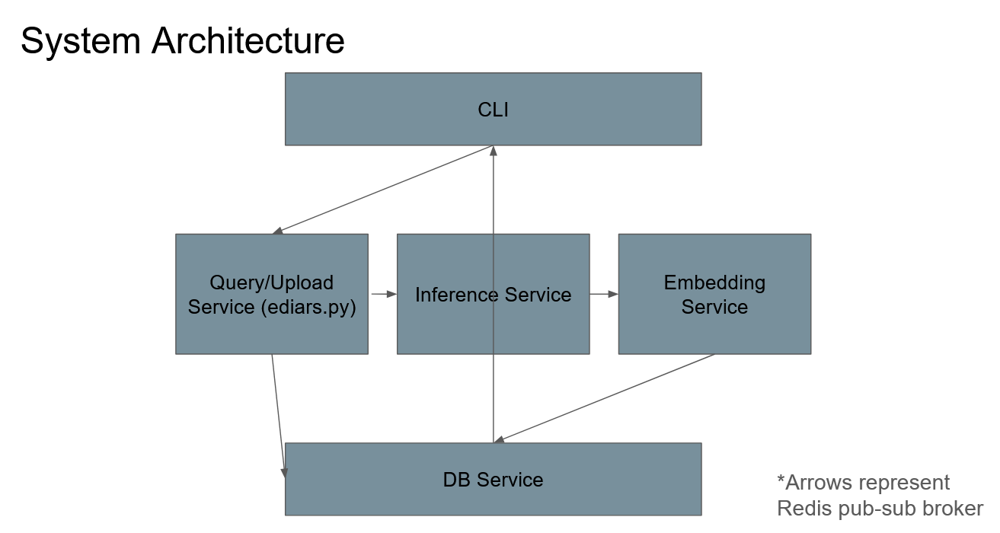

Event Driven Image Annotation and Retrieval System (EDIARS)

A visual object retrieval system using natural language. Specific application to biological cell images. Created for a school assignment.

The focus is on the implementation of asynchronous, modular software workflows using pub-sub and vector databases. 

[Explainer Video](https://youtu.be/lC5EMi6ngUs)